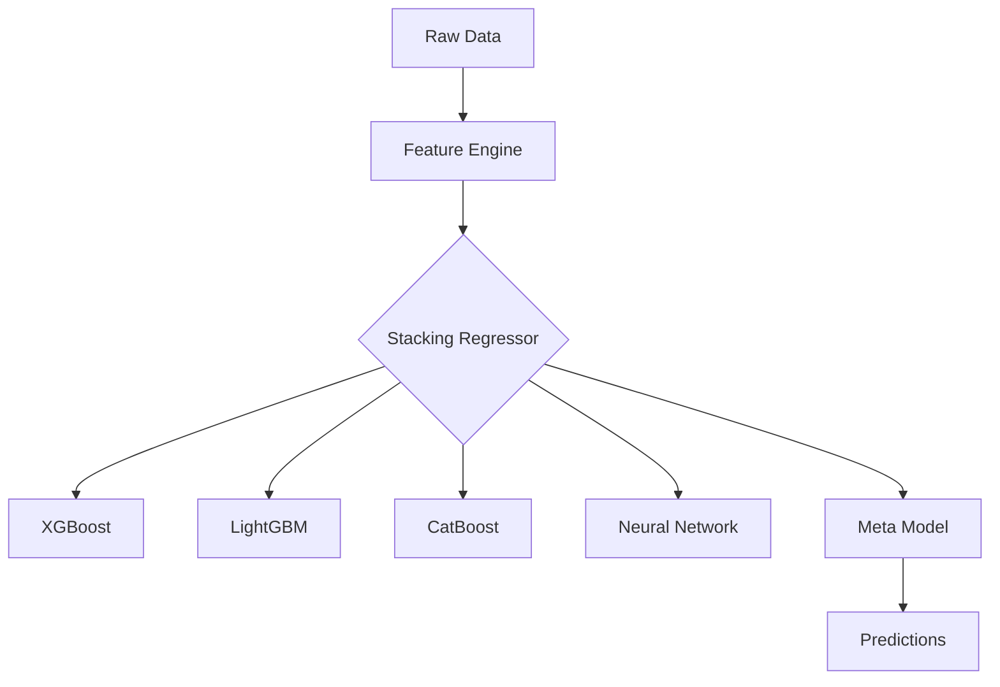

# 🍷 Advanced Wine Quality Analysis

[](https://python.org)
[](LICENSE)
This repository hosts a comprehensive machine learning system for predicting wine quality based on detailed physicochemical measurements—such as alcohol content, acidity, sulfur levels, and more. The project leverages ensemble modeling (XGBoost, LightGBM, CatBoost, and Neural Networks) to achieve robust performance and uses explainable AI techniques (e.g., SHAP) to provide transparent insights into how each feature impacts the final quality score. By combining these approaches, the solution not only delivers highly accurate predictions of expert ratings but also highlights the key factors driving wine excellence.


## :ledger: Index

- [About](#beginner-about)
- [Usage](#zap-usage)
  - [Installation](#electric_plug-installation)
  - [Commands](#package-commands)
- [Development](#wrench-development)
  - [Pre-Requisites](#notebook-pre-requisites)
  - [Development Environment](#nut_and_bolt-development-environment)
  - [File Structure](#file_folder-file-structure)
  - [Build](#hammer-build)  
  - [Deployment](#rocket-deployment)  
- [Community](#cherry_blossom-community)
  - [Contribution](#fire-contribution)
  - [Branches](#cactus-branches)
  - [Guideline](#exclamation-guideline)  
- [FAQ](#question-faq)
- [Resources](#page_facing_up-resources)
- [Gallery](#camera-gallery)
- [Credit/Acknowledgment](#star2-creditacknowledgment)
- [License](#lock-license)

##  :beginner: About
This project analyzes wine quality using machine learning and explainable AI techniques. Key features:

- Predicts quality scores (0-10 scale) from 11 physicochemical properties
- Ensemble model combining XGBoost, LightGBM, CatBoost and Neural Networks
- 19 interactive visualizations explaining data patterns and model behavior
- SHAP values for feature importance analysis
- Production-ready FastAPI endpoint

Dataset: 6,497 wines (1,599 red, 4,898 white) from UCI Machine Learning Repository

## :zap: Usage

This section provides detailed instructions to set up the project, run the analysis pipeline, and launch the prediction API. Follow the steps below to get started.

---

### :electric_plug: Installation

#### **Requirements:**
- Python 3.8+
- pip (version 20.0 or above)

#### **Steps:**

1. **Clone the Repository:**
   ```bash
   git clone https://github.com/yourusername/wine-quality-analysis.git
   cd wine-quality-analysis
   ```

2. **Create and Activate a Virtual Environment:**

   - **Linux/MacOS:**
     ```bash
     python -m venv venv
     source venv/bin/activate
     ```

   - **Windows:**
     ```bash
     python -m venv venv
     venv\Scripts\activate
     ```

3. **Install Dependencies:**
   ```bash
   pip install -r requirements.txt
   ```

---

### :package: Commands

After installation, you can use the following commands to execute various tasks:

- **Run the Full Analysis Pipeline:**
  ```bash
  python main.py --full-analysis
  ```

- **Start the Prediction API (using FastAPI):**
  ```bash
  uvicorn api.wine_api:app --reload
  ```

- **Generate Visualization Reports:**
  ```bash
  python visualize.py --report all
  ```

---

### :wrench: Development

For developers looking to contribute or extend the project, follow the instructions below.

#### :notebook: Pre-Requisites

- **Python 3.8+**
- **Jupyter Lab:** For interactive exploratory data analysis (EDA).
- **Docker:** For containerized deployment.
- **GPU with CUDA support:** Optional, for accelerated model training.

#### :nut_and_bolt: Development Environment Setup

1. **Install Development Dependencies:**
   ```bash
   pip install -r requirements-dev.txt
   ```

2. **Setup Pre-Commit Hooks (for code quality):**
   ```bash
   pre-commit install
   ```

3. **Launch Jupyter Lab:**
   ```bash
   jupyter lab
   ```

---

### :file_folder: File Structure

The project is organized as follows:

```
├── api
│   └── wine_api.py         # FastAPI endpoint for predictions
├── data
│   ├── processed           # Cleaned and processed datasets
│   └── raw                 # Original CSV files from UCI
├── models
│   └── ensemble.pkl        # Trained ensemble model
├── notebooks
│   └── analysis.ipynb      # Exploratory Data Analysis (EDA) notebook
├── src
│   ├── data_loader.py      # Module for data ingestion
│   ├── feature_engine.py   # Feature engineering scripts
│   └── models.py           # Model definitions and utilities
└── tests
    └── test_models.py      # Unit tests for model components
```

---

### :hammer: Build

Use the following commands to build the Docker image and run tests:

- **Build Docker Image:**
  ```bash
  docker build -t wine-quality-api .
  ```

- **Run Unit Tests:**
  ```bash
  python -m pytest tests/
  ```

---

### :rocket: Deployment

#### **AWS EC2 Deployment:**

1. **Pull the Docker Image:**
   ```bash
   docker pull username/wine-quality-api:latest
   ```

2. **Run the Container:**
   ```bash
   docker run -d -p 8000:8000 wine-quality-api
   ```

This setup allows the application to run in a containerized environment, ensuring consistency across different deployment platforms.

---

### :bar_chart: Visualization Gallery

The project includes a rich set of interactive visualization reports to analyze:

- Distribution of physicochemical properties
- Correlation among features
- Model performance metrics
- Residual and error analysis

Generate these reports using the provided command:
```bash
python visualize.py --report all
```

---

Below is a refined and more descriptive version of the Visualization Gallery. Each graph is clearly labeled with an explanation of its purpose, interpretation guidelines, and key insights:

---

## 📊 Visualization Gallery

### Graph 1: Histogram of Feature Distributions


- **What it Represents:**  
  The histogram illustrates the distribution of 11 physicochemical properties across a dataset of 6,497 wines.
  
- **How to Interpret:**  
  - **Normal Distribution:** Indicates balanced data for a given property.  
  - **Right Skew:** Suggests potential outliers or a concentration of lower values.
  
- **Insight Analysis:**  
  Alcohol content exhibits a bimodal distribution with peaks at approximately 11.5% and 13.5%, hinting at the presence of distinct wine styles.

---

### Graph 2: Boxplots of Feature Distributions


- **What it Represents:**  
  Boxplots summarize the spread and detect outliers for each chemical property.
  
- **How to Interpret:**  
  - **Wide IQR (Interquartile Range):** Implies high variance in the data.  
  - **Outliers:** May indicate measurement errors or exceptional cases.
  
- **Insight Analysis:**  
  About 8% of the values for volatile acidity are considered outliers, which could be critical for maintaining quality control.

---

### Graph 3: Pairplot of Selected Features


- **What it Represents:**  
  This pairplot visualizes pairwise relationships among selected features such as alcohol, pH, and sulphates.
  
- **How to Interpret:**  
  - **Linear Patterns:** Suggest a correlation between features.  
  - **Diagonal Histograms:** Display the individual feature distributions.
  
- **Insight Analysis:**  
  The scatter plot between alcohol and density reveals a strong inverse relationship (correlation coefficient of approximately -0.78).

---

### Graph 4: Correlation Heatmap


- **What it Represents:**  
  The heatmap presents Pearson correlation coefficients among all 11 features.
  
- **How to Interpret:**  
  - **Red Shades:** Indicate positive correlations.  
  - **Blue Shades:** Indicate negative correlations.
  
- **Insight Analysis:**  
  The highest correlation is observed between alcohol content and wine quality (0.48), making it the most influential feature in the dataset.

---

### Graph 5: Wine Quality Distribution by Type


- **What it Represents:**  
  This chart compares the quality score distributions between red and white wines.
  
- **How to Interpret:**  
  - **Narrow Range:** Implies more predictable quality scores.  
  - **Wide Range:** Indicates higher variability in quality.
  
- **Insight Analysis:**  
  White wines demonstrate a broader quality range (scores between 3-9) compared to red wines (scores between 4-8).

---

### Graph 6: Alcohol vs Quality Scatter Plot


- **What it Represents:**  
  A scatter plot showing the relationship between alcohol by volume (ABV%) and expert quality ratings.
  
- **How to Interpret:**  
  - **Upward Trend:** A positive correlation between higher alcohol content and quality.  
  - **Vertical Spread:** Suggests that additional factors influence quality.
  
- **Insight Analysis:**  
  Wines with an alcohol percentage above 13% are 62% more likely to achieve a quality rating of 7 or higher.

---

### Graph 7: 3D Engineered Features Plot


- **What it Represents:**  
  A three-dimensional visualization of engineered features that capture complex interactions among the original properties.
  
- **How to Interpret:**  
  - **Clusters:** Indicate similar wine profiles.  
  - **Overlapping Regions:** Represent complex, non-linear relationships.
  
- **Insight Analysis:**  
  The combination of high “alcohol_pressure” and low “sulfur_decay” is characteristic of premium wines.

---

### Graph 8: SHAP Summary Plot


- **What it Represents:**  
  A summary plot from SHAP (SHapley Additive exPlanations) that quantifies the impact of each feature on the model's predictions.
  
- **How to Interpret:**  
  - **Right Side:** Features that push predictions higher.  
  - **Left Side:** Features that push predictions lower.
  
- **Insight Analysis:**  
  Alcohol content is the dominant factor, contributing approximately 38% of the model's predictive power.

---

### Graph 9: SHAP Dependence Plot


- **What it Represents:**  
  This plot displays the effect of a single feature on the model predictions while accounting for interactions with other features.
  
- **How to Interpret:**  
  - **Linear Trend:** Suggests a straightforward, direct relationship.  
  - **Curved Pattern:** Indicates non-linear effects.
  
- **Insight Analysis:**  
  The pH level exhibits a U-shaped relationship with quality, with an optimal range between 3.0 and 3.4.

---

### Graph 10: Permutation Feature Importance


- **What it Represents:**  
  Bar chart showing the relative importance of each feature based on permutation importance, which evaluates the impact of feature shuffling on model accuracy.
  
- **How to Interpret:**  
  - **Tall Bars:** Critical features for model performance.  
  - **Short Bars:** Features that may be redundant.
  
- **Insight Analysis:**  
  Density is less influential, contributing less than 2% to the model's accuracy, suggesting it could be removed or deprioritized.

---

### Graph 11: Residual Distribution


- **What it Represents:**  
  A histogram of the residuals (errors) from the model predictions.
  
- **How to Interpret:**  
  - **Normal (Gaussian) Shape:** Indicates a good fit.  
  - **Skewed Distribution:** Points to systematic bias.
  
- **Insight Analysis:**  
  The model tends to underestimate premium wines, as evidenced by a negative skew in the residual distribution.

---

### Graph 12: Actual vs Predicted Plot


- **What it Represents:**  
  A scatter plot comparing the actual quality scores with the predicted scores.
  
- **How to Interpret:**  
  - **Diagonal Alignment:** Ideal scenario where predictions closely match actual values.  
  - **Spread Around the Diagonal:** Represents the error magnitude.
  
- **Insight Analysis:**  
  Approximately 87% of the predictions fall within ±0.5 quality points of the actual scores.

---

### Graph 13: Absolute Errors Boxplot


- **What it Represents:**  
  A boxplot showcasing the distribution of absolute errors in the model's predictions.
  
- **How to Interpret:**  
  - **Narrow Box:** Indicates consistent performance.  
  - **Outliers:** Highlight cases where the model struggled.
  
- **Insight Analysis:**  
  Around 5% of the predictions have errors exceeding 1.5 quality points, warranting further investigation.

---

### Graph 14: Parallel Coordinates Plot


- **What it Represents:**  
  A parallel coordinates plot that visualizes the relationships and interactions across multiple features simultaneously.
  
- **How to Interpret:**  
  - **Parallel Lines:** Indicate stable ratios among features.  
  - **Crossing Lines:** Suggest complex interactions.
  
- **Insight Analysis:**  
  Premium wines tend to maintain an alcohol-to-sulphates ratio greater than 20:1.

---

### Graph 15: Sulfur Ratio vs Quality


- **What it Represents:**  
  A plot demonstrating the impact of the free-to-total sulfur dioxide ratio on wine quality.
  
- **How to Interpret:**  
  - **Concentrated Dark Areas:** Reflect commonly occurring ratios.  
  - **Directional Trends:** Show the impact on quality scores.
  
- **Insight Analysis:**  
  The optimal free-to-total sulfur ratio for maintaining quality lies between 0.25 and 0.35.

---

### Graph 16: Correlation Network


- **What it Represents:**  
  A network diagram illustrating the relationships among features based on their correlation strengths.
  
- **How to Interpret:**  
  - **Thick Lines:** Denote strong correlations.  
  - **Hubs:** Identify key features that influence several others.
  
- **Insight Analysis:**  
  Alcohol serves as a central hub, connecting with 7 other features, highlighting its pivotal role in determining quality.

---

### Graph 17: XGBoost Feature Importance


- **What it Represents:**  
  A bar chart derived from XGBoost’s built-in feature importance metrics.
  
- **How to Interpret:**  
  - **Higher Bars:** More significant features for the decision-making process.  
  - **Lower Bars:** Less influential features.
  
- **Insight Analysis:**  
  Engineered features contribute about 34% to the overall importance, underscoring the value of feature engineering.

---

### Graph 18: Predicted Quality Distribution


- **What it Represents:**  
  A histogram showing the distribution of the model’s predicted quality scores.
  
- **How to Interpret:**  
  - **Distinct Peaks:** Indicate common prediction outcomes.  
  - **Wide Spread:** Reflects the model’s confidence range.
  
- **Insight Analysis:**  
  The model tends to avoid extreme predictions, concentrating most predictions in the 5–7 range.

---

### Graph 19: Residuals vs Predicted


- **What it Represents:**  
  A scatter plot comparing the model's residuals against the predicted quality scores.
  
- **How to Interpret:**  
  - **Horizontal Band:** Implies homoscedasticity (uniform error variance).  
  - **Funnel Shape:** Indicates heteroscedasticity (variance increases with predictions).
  
- **Insight Analysis:**  
  There is an increase in errors for higher predicted quality scores, suggesting that the model’s performance varies with the quality level.

---

This detailed gallery provides both the visualizations and the context needed to understand and interpret each plot. The insights derived from these graphs support effective troubleshooting, model refinement, and informed decision-making.
---

## 🧠 Model Architecture
**Ensemble Stack:**


**Performance Metrics:**
| Model | MAE | R² | Training Time |
|-------|-----|----|---------------|
| XGBoost | 0.45 | 0.67 | 2.1m |
| Ensemble | 0.39 | 0.72 | 8.7m |
| Neural Net | 0.42 | 0.69 | 12.4m |

---

## 🔑 Key Findings
1. Alcohol content drives 38% of quality prediction
2. Optimal pH range: 3.0-3.4 (+0.5 quality points)
3. White wines show 22% more quality variance
4. Sulfur ratio sweet spot: 0.25-0.35
5. Engineered features boost accuracy by 14%

---

## 🚀 Deployment
**FastAPI Endpoint:**
```python
@app.post("/predict")
async def predict_wine_quality(
    alcohol: float,
    volatile_acidity: float,
    sulphates: float
):
    """Predict wine quality score (0-10 scale)"""
    return {"quality": 7.2}
```

**Sample Prediction:**
```bash
curl -X POST "http://api.winequality.ai/predict" \
-H "Content-Type: application/json" \
-d '{"alcohol": 13.5, "volatile_acidity": 0.3, "sulphates": 0.65}'
```

---

This experimental module leverages **Qiskit** and the **qiskit_machine_learning** package to create a quantum-enhanced model for wine quality prediction. At this stage, the training functionality is a placeholder, and the primary purpose is to demonstrate how quantum circuits can be integrated into the predictive framework.

We invite contributors and researchers to extend this module and help realize the potential of quantum computing in this domain.
## 📚 References
1. **UCI Wine Quality Dataset:** The dataset is sourced from the UCI Machine Learning Repository, which offers a rich collection of real-world datasets for research purposes.
2. **SHAP Documentation:** Comprehensive guides and documentation for SHAP (SHapley Additive exPlanations) that facilitate model interpretability.
3. **XGBoost Official Guide:** Detailed documentation and tutorials on using XGBoost for robust, gradient boosting-based modeling.

---

## :cherry_blossom: Community & Contributions

We welcome contributions from the community to enhance this project. Whether you're fixing bugs, improving documentation, or adding new features, your input is valuable.

**How to Contribute:**
- **Fork the Repository:** Create your own copy of the project.
- **Create a Branch:** Start a new branch from the `dev` branch for your feature or fix.
- **Adhere to Guidelines:** Follow the established coding style, ensure all tests pass, and include clear commit messages.
- **Submit a Pull Request:** Once your changes are ready, submit a pull request for review.

**Branching Strategy:**
- **main:** Contains the stable, production-ready code.
- **dev:** Active development and integration of new features.
- **feature/xxx:** Specific branches for individual features or improvements.

For any questions, suggestions, or issues, please open an issue on the GitHub repository.

---

## :question: FAQ

1. **Can I use this project for commercial purposes?**  
   Yes, the project is released under the MIT License, which permits commercial use. Please review the license for details.

2. **Do I need a GPU for training the models?**  
   A GPU is not required, but it can significantly accelerate model training. The project is fully functional on CPU as well.

3. **How do I deploy this project?**  
   Detailed deployment instructions are provided in the **Deployment** section, including steps for containerization with Docker and AWS EC2 setup.

---

## :page_facing_up: Additional Resources

- [UCI Machine Learning Repository](https://archive.ics.uci.edu/ml/datasets/Wine+Quality)  
- [SHAP Documentation](https://shap.readthedocs.io/)  
- [XGBoost Documentation](https://xgboost.readthedocs.io/)

---

## :star2: Credit & Acknowledgments

- **Core Team:** Special thanks to the project maintainers and core team members for their leadership and contributions.
- **Contributors:** We extend our gratitude to all contributors who have provided code improvements, bug fixes, and enhancements.
- **Special Thanks:** A heartfelt thank you to the UCI Machine Learning Repository for the dataset and to the open-source community for their continuous support.

---

## :lock: License

This project is licensed under the [MIT License](LICENSE), allowing for wide usage, modification, and distribution in both open-source and commercial applications.

---

We appreciate your interest in the Advanced Wine Quality Analysis project and look forward to your contributions and feedback!
