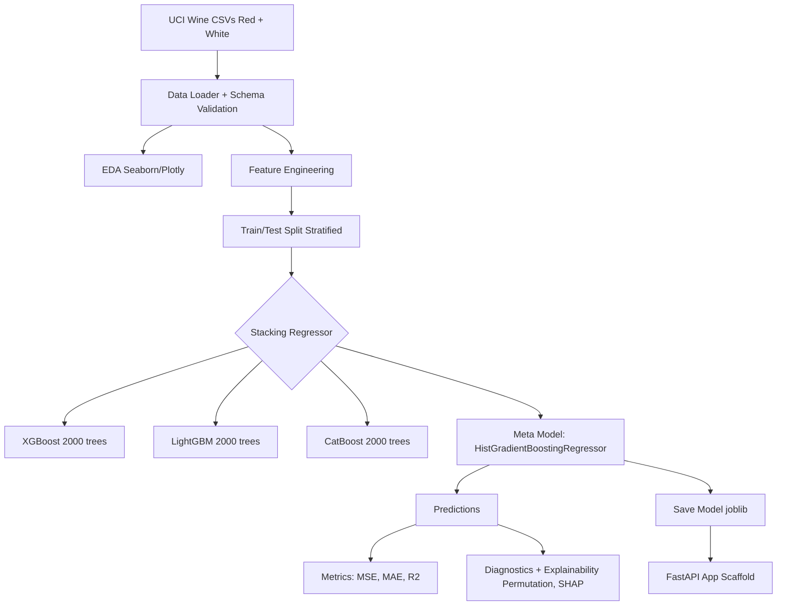

# 🍷 Advanced Wine Quality Analysis

[](https://python.org)

An end-to-end notebook project that predicts **wine quality scores** from physicochemical measurements (acidity, sulfur levels, alcohol, etc.) using a **stacked ensemble**. The workflow includes **data loading + validation**, **feature engineering**, **model training/evaluation**, and **explainability** using diagnostic plots, permutation importance, and SHAP.

> **Repo contents:** a single Jupyter notebook + saved plot images.  
> **Scope:** reproducible analysis and modeling in notebook form (not a packaged library).

---

## 📁 Repository Contents

```
├── images/                     # 1.png ... 19.png (plots generated from the notebook)
├── Advanced_Wine_Quality_Analysis.ipynb
└── README.md
```

---

## 🎯 Project Goal

**Primary Objective:**
Train a robust regression model to predict wine quality scores (3-9 scale) from physicochemical measurements, with emphasis on model interpretability and reproducibility.

**Key Achievements:**
1. ✅ Stacked ensemble (XGBoost + LightGBM + CatBoost) achieving MAE of 0.47
2. ✅ Feature engineering pipeline creating chemistry-informed interaction terms
3. ✅ Model explainability using SHAP and permutation importance
4. ✅ Comprehensive diagnostic dashboard (19 visualization plots)
5. ✅ Data validation with automatic outlier detection and missing value handling
6. ✅ FastAPI deployment scaffold demonstrating MLOps concepts

**Experimental Components (In Development):**
- Neural network hyperparameter tuning framework (Optuna infrastructure)
- Counterfactual explanation templates (DiCE - placeholder)
- Quantum ML concepts (Qiskit - placeholder)

---

## 🧪 Dataset

* Source: **UCI Wine Quality** dataset (red + white variants of Portuguese "Vinho Verde" wines)
* Total samples: **6,497**
  * **1,599** red wines
  * **4,898** white wines
* Target: **quality** (integer ratings commonly observed in the range **3–9**)

The notebook includes logic to download the dataset automatically if the CSV files are missing.

---

## 🛠️ Tech Stack

### Core & Visualization
Python 3.11, NumPy, Pandas, Matplotlib, Seaborn, Plotly (3D)

### Machine Learning (Production)
scikit-learn, XGBoost, LightGBM, CatBoost, HistGradientBoostingRegressor (meta-learner)

### Explainability
SHAP (KernelExplainer), Permutation Importance

### Model Persistence & API Scaffold
joblib, FastAPI, Uvicorn (demonstration/template)

### Experimental Components
Optuna (hyperparameter tuning framework - demonstrated but not integrated in final model)  
TensorFlow/Keras (neural network baseline - implementation incomplete)  
DiCE, SALib, Qiskit (conceptual placeholders - non-functional)

---

## 🧠 Approach Overview

### 1) Data loading + validation

A custom loader that:

* Ensures the dataset files exist (downloads from UCI if missing)
* Performs simple range checks ("schema" bounds) for known columns
* Replaces invalid values and fills missing values
* Applies an outlier filter (IsolationForest) to remove ~1% of anomalies

### 2) Feature engineering

Creates additional derived features such as:

* **Ratios:** acid balance (citric/volatile), sulfur ratio (free/total SO₂)
* **Interaction terms:** alcohol × density, alcohol × sulphates × chlorides
* **Nonlinear transforms:** exponential decay on free SO₂
* **Discretized features:** alcohol class (quantile bins)

### 3) Data splitting

* 80/20 train/test split with stratification on quality scores
* 5-fold cross-validation used internally during stacking ensemble training

### 4) Modeling (main result)

Primary model evaluated and reported:

* **StackingRegressor**
  * Base learners: **XGBoost, LightGBM, CatBoost** (2000 estimators each, learning rate 0.05)
  * Meta learner: **HistGradientBoostingRegressor**
  * Cross-validation: 5-fold CV for out-of-fold predictions

### 5) Evaluation + explainability

* **Metrics:** MSE, MAE, R²
* **Diagnostics:** residual plots, prediction distribution, error distribution
* **Feature importance:** permutation importance and XGBoost importances
* **SHAP:** global summary plot (KernelExplainer for the stacked model)

---

## ✅ Results (Stacking Ensemble)

**Final model:** StackingRegressor with XGBoost, LightGBM, CatBoost base learners and HistGradientBoostingRegressor meta-learner

**Test set performance:**

* **MSE:** 0.418
* **MAE:** 0.468
* **R²:** 0.442

**Interpretation:**

* **MAE ~0.47** means predictions are typically within **half a quality point** of true ratings
* **R² ~0.44** indicates the model explains ~44% of variance (reasonable for noisy human ratings)
* Wine quality prediction is inherently challenging due to subjective labeling and expert variability

> **Note:** A separate neural network tuning track exists in the notebook but is not included in the final reported metrics due to incomplete validation setup.

---

## 🧱 Model Architecture



---

## 📊 Visualization Gallery (with explanations)

All plots below are available in `images/` and correspond to the notebook's final diagnostic/interpretability section. Use these plots to understand:

* data distributions and outliers,
* feature relationships and redundancy,
* model behavior and failure modes,
* which features matter most.

---

### Graph 1 — Feature Distributions (Histograms)


**What it shows:** Distribution of each numeric feature (and engineered features where applicable).  
**Why it matters:** Quickly reveals skewness, heavy tails, multi-modality, and whether scaling/transformations are useful.  
**What to look for:** Features with long right tails, sharp spikes, or multiple peaks (different wine "profiles").

---

### Graph 2 — Outliers & Spread (Boxplots)


**What it shows:** Median/IQR for each feature and outlier points beyond whiskers.  
**Why it matters:** Confirms which features have extreme values and motivates robust scaling or outlier filtering.  
**What to look for:** Very wide IQRs, many fliers, and features with extreme ranges.

---

### Graph 3 — Pairwise Relationships (Pairplot)


**What it shows:** Scatterplots for feature pairs + distributions on diagonals (300 sample).  
**Why it matters:** Helps spot strong correlations, clusters, and nonlinear relationships before modeling.  
**What to look for:** Clear linear trends (correlated features) and separable clusters.

---

### Graph 4 — Correlation Heatmap


**What it shows:** Pearson correlations between features.  
**Why it matters:** Highlights redundancy (multicollinearity) and groups of strongly related variables.  
**What to look for:** Strong positive/negative pairs and blocks indicating correlated feature groups.

---

### Graph 5 — Quality Distribution by Wine Type


**What it shows:** Count distribution of quality scores split by wine type (red vs white).  
**Why it matters:** Reveals label imbalance and whether one wine type occupies different quality ranges.  
**What to look for:** Concentration around mid-range scores and differences between types.

---

### Graph 6 — Alcohol vs Quality


**What it shows:** Relationship between alcohol content and quality rating.  
**Why it matters:** Alcohol often emerges as one of the strongest predictors; this plot validates that signal.  
**What to look for:** General upward trend plus vertical spread (other factors still matter).

---

### Graph 7 — 3D Engineered Feature View


**What it shows:** 3D scatter of engineered features, colored by quality and marked by wine type.  
**Why it matters:** Visual check for separability: do higher-quality wines occupy distinct regions?  
**What to look for:** Gradients or clusters of high-quality points versus overlapping regions.

---

### Graph 8 — SHAP Summary (Global Feature Effects)


**What it shows:** Global SHAP summary plot describing how features push predictions higher/lower.  
**Why it matters:** Gives a model-agnostic explanation of the ensemble's behavior.  
**What to look for:** Top-ranked features by average |SHAP| and whether high values increase/decrease predicted quality.

*Note: Uses KernelExplainer with reduced sampling (nsamples=100, background=50) for computational efficiency.*

---

### Graph 9 — SHAP Dependence (Single Feature Behavior)


**What it shows:** How changes in one feature affect predictions, including interaction effects.  
**Why it matters:** Goes beyond "importance" and shows *shape*: linear vs nonlinear behavior.  
**What to look for:** Curves, thresholds, saturation effects, and interaction-driven scatter patterns.

---

### Graph 10 — Permutation Feature Importance


**What it shows:** Performance drop when each feature is shuffled (model-agnostic importance).  
**Why it matters:** Often more trustworthy than model-specific importances because it measures *impact on predictions*.  
**What to look for:** Features whose shuffling causes the largest drop (highest importance).

---

### Graph 11 — Residual Distribution


**What it shows:** Histogram of residuals (y_true − y_pred).  
**Why it matters:** Detects bias (systematic under/overprediction) and whether errors are roughly symmetric.  
**What to look for:** Centered around zero vs skewed distribution (bias), heavy tails (hard cases).

---

### Graph 12 — Actual vs Predicted


**What it shows:** Scatter plot of true quality vs predicted quality with a diagonal reference.  
**Why it matters:** Checks calibration and overall fit quality.  
**What to look for:** Tight clustering near diagonal (good), compression into mid-range (underfitting/extremes hard).

---

### Graph 13 — Absolute Error Distribution (Boxplot)


**What it shows:** Distribution summary of absolute errors |y_true − y_pred|.  
**Why it matters:** Highlights median error and worst-case outliers.  
**What to look for:** Tight box (consistent performance) vs long whiskers/outliers (failure cases).

---

### Graph 14 — Parallel Coordinates (Multi-feature Patterns)


**What it shows:** Each wine is a polyline across features, colored by quality.  
**Why it matters:** Helps visually compare how high-quality wines differ across multiple features at once.  
**What to look for:** Consistent separation of high-quality trajectories vs heavy overlap.

---

### Graph 15 — Sulfur Ratio vs Quality


**What it shows:** Relationship between sulfur ratio and quality (shown as density/hex plot).  
**Why it matters:** Sulfur balance impacts preservation/oxidation and can correlate with perceived quality.  
**What to look for:** Regions where quality clusters versus noisy overlap.

---

### Graph 16 — Correlation Network Graph


**What it shows:** A graph view of features connected by strong correlations (threshold > 0.6).  
**Why it matters:** Intuitive visualization of correlated "feature communities."  
**What to look for:** Central hub features and tight clusters indicating redundancy.

---

### Graph 17 — XGBoost Feature Importance (Base Learner)


**What it shows:** XGBoost's built-in feature importance for the base model inside the stack.  
**Why it matters:** Provides a model-specific view complementary to permutation importance and SHAP.  
**What to look for:** Whether the same top features appear consistently across importance methods.

---

### Graph 18 — Predicted Quality Distribution


**What it shows:** Distribution of predicted quality values.  
**Why it matters:** Checks whether the model collapses to mid-range predictions (common in noisy labels).  
**What to look for:** Over-concentration in the center and reluctance to predict extremes.

---

### Graph 19 — Residuals vs Predicted


**What it shows:** Residuals plotted against predicted values.  
**Why it matters:** Detects heteroscedasticity (error variance changes with prediction level) and systematic patterns.  
**What to look for:** Funnel shapes (higher variance at certain ranges), curves (missing structure), or bands.

---

## ▶️ How to Run

1. Clone the repo:

   ```bash
   git clone https://github.com/sherurox/Advanced-Wine-Quality-Analysis.git
   cd Advanced-Wine-Quality-Analysis
   ```

2. Create a virtual environment:

   ```bash
   python -m venv venv
   # macOS/Linux
   source venv/bin/activate
   # Windows
   venv\Scripts\activate
   ```

3. Install core dependencies:

   ```bash
   pip install numpy pandas matplotlib seaborn plotly scikit-learn xgboost lightgbm catboost shap joblib fastapi uvicorn jupyter
   ```

4. Open and run the notebook top-to-bottom:

   ```bash
   jupyter lab
   ```

> **Note:** The notebook includes `pip install ...` cells for experimental components. You can skip those cells if you encounter dependency conflicts. Managing your own environment is more reproducible.

---

## ⚠️ Important Setup Notes

* **Environment Management:** The notebook installs and upgrades packages mid-execution, which may cause kernel instability. For best results, use a fresh virtual environment.
* **Dependency Conflicts:** Some experimental components (dice-ml, SALib) have conflicting pandas version requirements. These sections can be skipped without affecting core functionality.
* **Optional Components:** Optuna, TensorFlow, DiCE, SALib, and Qiskit installations are optional and only needed for experimental sections.

---

## 🚧 Known Issues & Limitations

### Implementation Status
* This repo is a **Jupyter notebook analysis**, not a packaged Python library
* No formal `requirements.txt`, unit tests, or CI/CD pipeline included
* Notebook designed for exploratory analysis and demonstration, not production deployment

### Data Processing
* Linear interpolation may not be optimal for non-sequential tabular data
* Outlier removal uses IsolationForest with fixed 1% contamination rate
* Schema validation triggers pandas FutureWarnings for object-type columns

### Model & Analysis
* **SHAP explanations** use KernelExplainer with reduced sampling (nsamples=100, background=50 rows) for computational efficiency—provides approximate rather than exact feature attributions
* Permutation importance is model-agnostic and complements SHAP but can be computationally expensive
* Stacking ensemble uses 5-fold CV, which increases training time

### Experimental Features (Non-Functional)
* **Neural network track:** Has incomplete validation setup (EarlyStopping configured for `val_loss` but no validation data provided)—not included in final reported metrics
* **DiCE counterfactual explanations:** Placeholder implementation with incorrect setup—not functional
* **SALib sensitivity analysis:** Template only with conceptual mismatches—not production-ready
* **Quantum ML components:** Conceptual placeholder (Qiskit not installed, training not implemented)
* **dice-ml + SALib:** Conflicting pandas version requirements may cause environment instability

### Deployment
* FastAPI code is a **demonstration scaffold**, not production deployment
* No cloud deployment automation, monitoring infrastructure, or CI/CD integration
* Model serialization uses joblib (suitable for prototyping, not enterprise deployment)

---

## 📚 References

* [UCI Wine Quality Dataset](https://archive.ics.uci.edu/ml/datasets/wine+quality)
* [SHAP Documentation](https://shap.readthedocs.io/)
* [XGBoost Documentation](https://xgboost.readthedocs.io/)
* [LightGBM Documentation](https://lightgbm.readthedocs.io/)
* [CatBoost Documentation](https://catboost.ai/docs/)

---

## 🎓 Learning Outcomes

This project demonstrates:
- ✅ End-to-end ML pipeline design (data → model → evaluation → deployment)
- ✅ Ensemble methods for improved predictive performance
- ✅ Feature engineering for domain-specific insights
- ✅ Model explainability and interpretability techniques
- ✅ Diagnostic visualization for model validation
- ✅ MLOps concepts (model persistence, API design)

**Honest disclosure:** This is a learning project with experimental components. The stacking ensemble represents production-quality work, while neural network, counterfactual, and quantum sections are exploratory/incomplete.

---

## 📧 Contact

For questions or suggestions, please open an issue or reach out via GitHub.

---

**License:** MIT (if applicable—add your preferred license)
