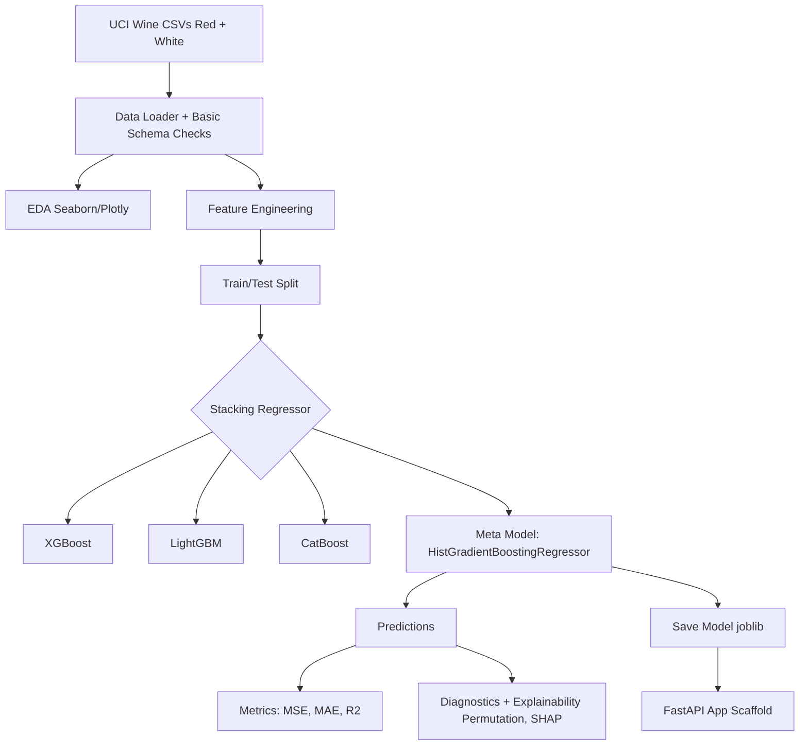

# 🍷 Advanced Wine Quality Analysis

[](https://python.org)

An end-to-end notebook project that predicts **wine quality scores** from physicochemical measurements (acidity, sulfur levels, alcohol, etc.) using a **stacked ensemble**. The workflow includes **data loading + basic validation**, **feature engineering**, **model training/evaluation**, and **explainability** using diagnostic plots, permutation importance, and SHAP.

> **Repo contents:** a single Jupyter notebook + saved plot images.  
> **Scope:** reproducible analysis and modeling in notebook form (not a packaged library).

---

## 📁 Repository Contents

```
├── images/                     # 1.png ... 19.png (plots generated from the notebook)
├── Advanced_Wine_Quality_Analysis.ipynb
└── README.md
```

---

## 🎯 Project Goal

1. Train a regression model to predict **wine quality** from chemical properties.
2. Improve performance using **feature engineering + stacking** (XGBoost/LightGBM/CatBoost with a meta model).
3. Validate behavior via **error diagnostics** (residual plots, actual vs predicted, error distribution).
4. Add **interpretability** (Permutation Importance + SHAP global explanations).
5. Demonstrate a **deployment path** by saving the trained ensemble model and generating a FastAPI app scaffold in the notebook.

---

## 🧪 Dataset

* Source: **UCI Wine Quality** dataset (red + white variants of Portuguese "Vinho Verde" wines)
* Total samples: **6,497**
  * **1,599** red wines
  * **4,898** white wines
* Target: **quality** (integer ratings commonly observed in the range **3–9**)

The notebook includes logic to download the dataset automatically if the CSV files are missing.

---

## 🛠️ Tech Stack (as implemented in the notebook)

**Core:** Python, NumPy, Pandas  
**Visualization:** Matplotlib, Seaborn, Plotly (3D)  
**Modeling:** scikit-learn, XGBoost, LightGBM, CatBoost, HistGradientBoostingRegressor (meta model)  
**Tuning/Deep Learning (experimental track):** Optuna, TensorFlow/Keras  
**Explainability:** SHAP, permutation importance  
**MLOps scaffold:** joblib, FastAPI, Uvicorn

---

## 🧠 Approach Overview

### 1) Data loading + basic validation

A custom loader:

* Ensures the dataset files exist (downloads from UCI if missing)
* Performs simple range checks ("schema" bounds) for known columns
* Replaces invalid values and fills missing values
* Applies an outlier filter (IsolationForest) to remove a small fraction of anomalies

### 2) Feature engineering

Creates additional derived features such as:

* Ratios (e.g., acid balance, sulfur ratio)
* Interaction terms (e.g., alcohol × density)
* Nonlinear transforms (e.g., exponential decay on free SO₂)
* Discretized alcohol class (quantile bins)

### 3) Modeling (main result)

Primary model evaluated and reported:

* **StackingRegressor**
  * Base learners: **XGBoost, LightGBM, CatBoost**
  * Meta learner: **HistGradientBoostingRegressor**

### 4) Evaluation + explainability

* Metrics: **MSE, MAE, R²**
* Diagnostics: residual plots, prediction distribution, error distribution
* Feature importance: permutation importance and XGBoost importances
* SHAP: global summary plot (KernelExplainer for the stacked model)

---

## ✅ Results (from notebook output)

Final ensemble evaluation printed in the notebook:

* **MSE:** 0.418
* **MAE:** 0.468
* **R²:** 0.442

What this means:

* **MAE ~0.47** → predictions are typically within about **half a quality point** of the true label.
* **R² ~0.44** → the model explains a meaningful portion of variance, while wine quality remains noisy and subjective.

---

## 🧱 Model Architecture



> The notebook also includes a neural network + Optuna tuning track as an additional experiment, but the **final reported metrics above are for the stacking ensemble**.

---

## 📊 Visualization Gallery (with explanations)

All plots below are available in `images/` and correspond to the notebook's final diagnostic / interpretability section. Use these plots to understand:

* data distributions and outliers,
* feature relationships and redundancy,
* model behavior and failure modes,
* which features matter most.

---

### Graph 1 — Feature Distributions (Histograms)


**What it shows:** Distribution of each numeric feature (and engineered features where applicable).  
**Why it matters:** Quickly reveals skewness, heavy tails, multi-modality, and whether scaling/transformations are useful.  
**What to look for:** Features with long right tails, sharp spikes, or multiple peaks (different wine "profiles").

---

### Graph 2 — Outliers & Spread (Boxplots)


**What it shows:** Median/IQR for each feature and outlier points beyond whiskers.  
**Why it matters:** Confirms which features have extreme values and motivates robust scaling or outlier filtering.  
**What to look for:** Very wide IQRs, many fliers, and features with extreme ranges.

---

### Graph 3 — Pairwise Relationships (Pairplot)


**What it shows:** Scatterplots for feature pairs + distributions on diagonals.  
**Why it matters:** Helps spot strong correlations, clusters, and nonlinear relationships before modeling.  
**What to look for:** Clear linear trends (correlated features) and separable clusters.

---

### Graph 4 — Correlation Heatmap


**What it shows:** Pearson correlations between features.  
**Why it matters:** Highlights redundancy (multicollinearity) and groups of strongly related variables.  
**What to look for:** Strong positive/negative pairs and blocks indicating correlated feature groups.

---

### Graph 5 — Quality Distribution by Wine Type


**What it shows:** Count distribution of quality scores split by wine type (red vs white).  
**Why it matters:** Reveals label imbalance and whether one wine type occupies different quality ranges.  
**What to look for:** Concentration around mid-range scores and differences between types.

---

### Graph 6 — Alcohol vs Quality


**What it shows:** Relationship between alcohol content and quality rating.  
**Why it matters:** Alcohol often emerges as one of the strongest predictors; this plot validates that signal.  
**What to look for:** General upward trend plus vertical spread (other factors still matter).

---

### Graph 7 — 3D Engineered Feature View


**What it shows:** 3D scatter of engineered features, colored by quality and marked by wine type.  
**Why it matters:** Visual check for separability: do higher-quality wines occupy distinct regions?  
**What to look for:** Gradients or clusters of high-quality points versus overlapping regions.

---

### Graph 8 — SHAP Summary (Global Feature Effects)


**What it shows:** Global SHAP summary plot describing how features push predictions higher/lower.  
**Why it matters:** Gives a model-agnostic explanation of the ensemble's behavior.  
**What to look for:** Top-ranked features by average |SHAP| and whether high values increase/decrease predicted quality.

---

### Graph 9 — SHAP Dependence (Single Feature Behavior)


**What it shows:** How changes in one feature affect predictions, including interaction effects.  
**Why it matters:** Goes beyond "importance" and shows *shape*: linear vs nonlinear behavior.  
**What to look for:** Curves, thresholds, saturation effects, and interaction-driven scatter patterns.

---

### Graph 10 — Permutation Feature Importance


**What it shows:** Performance drop when each feature is shuffled (model-agnostic importance).  
**Why it matters:** Often more trustworthy than model-specific importances because it measures *impact on predictions*.  
**What to look for:** Features whose shuffling causes the largest drop (highest importance).

---

### Graph 11 — Residual Distribution


**What it shows:** Histogram of residuals (y_true − y_pred).  
**Why it matters:** Detects bias (systematic under/overprediction) and whether errors are roughly symmetric.  
**What to look for:** Centered around zero vs skewed distribution (bias), heavy tails (hard cases).

---

### Graph 12 — Actual vs Predicted


**What it shows:** Scatter plot of true quality vs predicted quality with a diagonal reference.  
**Why it matters:** Checks calibration and overall fit quality.  
**What to look for:** Tight clustering near diagonal (good), compression into mid-range (underfitting/extremes hard).

---

### Graph 13 — Absolute Error Distribution (Boxplot)


**What it shows:** Distribution summary of absolute errors |y_true − y_pred|.  
**Why it matters:** Highlights median error and worst-case outliers.  
**What to look for:** Tight box (consistent performance) vs long whiskers/outliers (failure cases).

---

### Graph 14 — Parallel Coordinates (Multi-feature Patterns)


**What it shows:** Each wine is a polyline across features, colored by quality.  
**Why it matters:** Helps visually compare how high-quality wines differ across multiple features at once.  
**What to look for:** Consistent separation of high-quality trajectories vs heavy overlap.

---

### Graph 15 — Sulfur Ratio vs Quality


**What it shows:** Relationship between sulfur ratio and quality (often shown as density/hex or scatter).  
**Why it matters:** Sulfur balance impacts preservation/oxidation and can correlate with perceived quality.  
**What to look for:** Regions where quality clusters versus noisy overlap.

---

### Graph 16 — Correlation Network Graph


**What it shows:** A graph view of features connected by strong correlations (above a threshold).  
**Why it matters:** Intuitive visualization of correlated "feature communities."  
**What to look for:** Central hub features and tight clusters indicating redundancy.

---

### Graph 17 — XGBoost Feature Importance (Base Learner)


**What it shows:** XGBoost's built-in feature importance for the base model inside the stack.  
**Why it matters:** Provides a model-specific view complementary to permutation importance and SHAP.  
**What to look for:** Whether the same top features appear consistently across importance methods.

---

### Graph 18 — Predicted Quality Distribution


**What it shows:** Distribution of predicted quality values.  
**Why it matters:** Checks whether the model collapses to mid-range predictions (common in noisy labels).  
**What to look for:** Over-concentration in the center and reluctance to predict extremes.

---

### Graph 19 — Residuals vs Predicted


**What it shows:** Residuals plotted against predicted values.  
**Why it matters:** Detects heteroscedasticity (error variance changes with prediction level) and systematic patterns.  
**What to look for:** Funnel shapes (higher variance at certain ranges), curves (missing structure), or bands.

---

## ▶️ How to Run

1. Clone the repo:

   ```bash
   git clone https://github.com/sherurox/Advanced-Wine-Quality-Analysis.git
   cd Advanced-Wine-Quality-Analysis
   ```

2. Create a virtual environment:

   ```bash
   python -m venv venv
   # macOS/Linux
   source venv/bin/activate
   # Windows
   venv\Scripts\activate
   ```

3. Install dependencies (minimum set to run the notebook):

   ```bash
   pip install numpy pandas matplotlib seaborn plotly scikit-learn xgboost lightgbm catboost optuna shap joblib tensorflow fastapi uvicorn
   ```

4. Open and run the notebook top-to-bottom:

   ```bash
   jupyter lab
   ```

> The notebook includes `pip install ...` cells; you can use those, but managing your own environment is usually more reproducible.

---

## 🚧 Notes / Limitations

* This repo is **not packaged** as a Python module (no `requirements.txt`, scripts, or unit tests committed).
* SHAP uses **KernelExplainer** for the stacked model (approximate and slower than tree-specific explainers).
* Some sections in the notebook are **experimental placeholders** (counterfactuals, sensitivity analysis, quantum components).
* The FastAPI code is an **API scaffold** generated in-notebook (a starting point, not a full deployment pipeline).

---

## 📚 References

* UCI Wine Quality Dataset
* SHAP documentation
* XGBoost / LightGBM / CatBoost documentation
